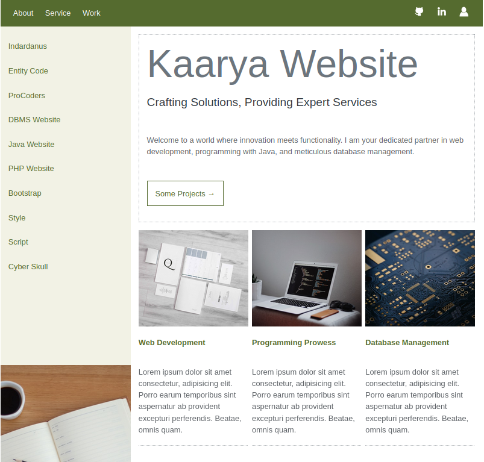

# website-3

- Name : "Kaarya_website"

- Description : "Elevating digital experiences through expert web development, Java programming, and meticulous database management."

- Version : main

- Update : 08-01-2024

- Status : REST

- Responsive : True

- TechStack : { HTML | CSS | JavaScript }

- Thanks : { GitHub | VSCodium | GIMP | Unplash | Indardanus }

- Collabrate : Self

- URL : https://username.github.io/Kaarya_website/

- Clone : https://github.com/username/Kaarya_website.git

- Download : https://github.com/username/Kaarya_website/archive/refs/heads/main.zip

#### Project Look & Feel

#### Responsive

_"This website prioritizes inclusivity and user experience ethics by being responsively designed for seamless accessibility across diverse devices."_

  **SCREEN** { 1200PX | 992PX | 785PX | 556PX }

#### Theme

_"Experience an impressive digital ambiance with our website, adorned in a soothing green light theme."_

#### Key Feature that make website more valuble

- [x] Responsive Design
- [x] Innovative Green Light Theme
- [x] Holistic Approach
- [x] Ethical Design Principles
- [x] Explain Service
- [x] Present Developer Skill

### Warning

__" We urge all users to respect the copyright and intellectual property rights associated with the content on this website. Unauthorized copying, downloading, or any form of content misuse is strictly prohibited. Such actions may lead to legal consequences and potential charges. "__

